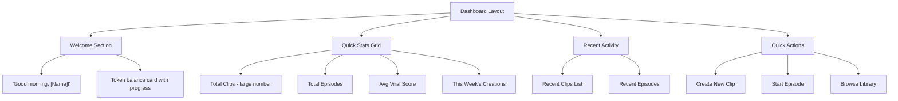
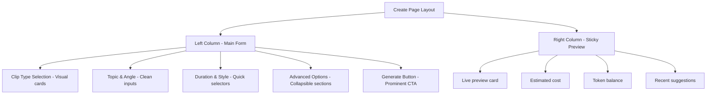

# Modern SaaS Redesign Plan for SubwayTakes

## Overview
Transform the SubwayTakes UI from the current dark/zinc aesthetic to a modern, polished SaaS design inspired by industry leaders like Linear, Vercel, and Raycast.

## Design Principles

### 1. Visual Identity
- **Color Palette**: Refined, muted tones with strategic accent colors
- **Typography**: Inter or system-ui with tight tracking for headings
- **Spacing**: Generous whitespace with consistent spacing scale (4, 8, 12, 16, 24, 32, 48, 64px)
- **Radius**: Consistent border-radius (6px-12px for components, 8px for buttons)
- **Depth**: Subtle shadows, glassmorphism for overlays, micro-interactions

### 2. Current State Analysis
| Component | Current Style | Issues |
|-----------|--------------|--------|
| Background | `bg-zinc-950` | Too dark, flat |
| Cards | `bg-zinc-900/50` | Low contrast, outdated |
| Buttons | Simple rounded | No hierarchy, flat |
| Forms | Basic inputs | No focus states, dated |
| Navigation | Simple nav | Lacks visual interest |
| Typography | Default sans | Inconsistent weights |

---

## Design System Specifications

### Color Palette

```javascript
// Tailwind theme extension
colors: {
  // Base grays (warmer, more sophisticated)
  gray: {
    50: '#F9FAFB',
    100: '#F3F4F6',
    200: '#E5E7EB',
    300: '#D1D5DB',
    400: '#9CA3AF',
    500: '#6B7280',
    600: '#4B5563',
    700: '#374151',
    800: '#1F2937',
    900: '#111827',
    950: '#030712',
  },
  // Brand accent (amber → refined gold/bronze)
  brand: {
    50: '#FEF3C7',
    100: '#FDE68A',
    200: '#FCD34D',
    300: '#FBBF24',
    400: '#F59E0B',
    500: '#D97706',
    600: '#B45309',
    700: '#92400E',
    800: '#78350F',
    900: '#451A03',
  },
  // Success, Warning, Error refined
  success: {
    50: '#ECFDF5',
    100: '#D1FAE5',
    500: '#10B981',
    600: '#059669',
  },
  warning: {
    50: '#FFFBEB',
    100: '#FEF3C7',
    500: '#F59E0B',
    600: '#D97706',
  },
  error: {
    50: '#FEF2F2',
    100: '#FEE2E2',
    500: '#EF4444',
    600: '#DC2626',
  },
}
```

### Typography Scale
```javascript
fontSize: {
  xs: '0.75rem',      // 12px
  sm: '0.875rem',     // 14px
  base: '0.9375rem',  // 15px (slightly larger than default 14px)
  lg: '1.0625rem',    // 17px
  xl: '1.25rem',      // 20px
  '2xl': '1.5rem',    // 24px
  '3xl': '1.875rem',  // 30px
  '4xl': '2.25rem',   // 36px
}
```

### Shadows & Effects
```javascript
boxShadow: {
  'soft': '0 2px 8px -1px rgba(0, 0, 0, 0.05), 0 1px 2px -1px rgba(0, 0, 0, 0.03)',
  'medium': '0 4px 16px -2px rgba(0, 0, 0, 0.08), 0 2px 4px -2px rgba(0, 0, 0, 0.04)',
  'strong': '0 8px 32px -4px rgba(0, 0, 0, 0.12), 0 4px 8px -4px rgba(0, 0, 0, 0.06)',
  'glow': '0 0 20px rgba(245, 158, 11, 0.3)',
  'inner-soft': 'inset 0 1px 2px rgba(0, 0, 0, 0.05)',
}
```

---

## Component Redesign Specifications

### 1. App Shell & Layout

**Current**: Full dark background, simple header
**Modern**: Layered layout with subtle gradients

```jsx
// Proposed structure
<div className="min-h-screen bg-gray-50 text-gray-900">
  {/* Subtle gradient mesh background */}
  <div className="fixed inset-0 -z-10">
    <div className="absolute inset-0 bg-[radial-gradient(ellipse_at_top,_var(--tw-gradient-stops))] from-gray-100 via-gray-50 to-white" />
  </div>
  
  {/* Glassmorphism header */}
  <header className="sticky top-0 z-50 border-b border-gray-200/50 bg-white/80 backdrop-blur-xl" />
  
  <main className="mx-auto max-w-7xl px-6 py-8">
    {/* Content */}
  </main>
</div>
```

### 2. Navigation Bar

**Current**: Plain buttons with simple hover states
**Modern**: Refined tabs with active indicators

```jsx
<nav className="flex items-center gap-1 p-1 bg-gray-100/50 rounded-xl">
  <button className="flex items-center gap-2 px-4 py-2 text-sm font-medium text-gray-600 hover:text-gray-900 rounded-lg transition-all">
    <LayoutDashboard className="h-4 w-4" />
    Dashboard
  </button>
  <button className="flex items-center gap-2 px-4 py-2 text-sm font-medium text-gray-600 hover:text-gray-900 rounded-lg transition-all">
    <Plus className="h-4 w-4" />
    Create
  </button>
  {/* Active state */}
  <button className="flex items-center gap-2 px-4 py-2 text-sm font-medium bg-white text-gray-900 shadow-soft rounded-lg transition-all">
    <Film className="h-4 w-4" />
    Library
  </button>
</nav>
```

### 3. Cards & Containers

**Current**: `bg-zinc-900/50 border-zinc-800`
**Modern**: White cards with subtle borders and shadows

```jsx
<div className="bg-white rounded-2xl border border-gray-200 shadow-soft overflow-hidden">
  {/* Header with subtle gradient */}
  <div className="px-6 py-4 border-b border-gray-100 bg-gray-50/50">
    <h3 className="text-sm font-semibold text-gray-900">Recent Clips</h3>
  </div>
  
  {/* Content */}
  <div className="p-6">
    {/* Card items */}
  </div>
</div>
```

### 4. Buttons

**Current**: Simple colored buttons
**Modern**: Hierarchical button system

```jsx
// Primary button
<button className="inline-flex items-center justify-center gap-2 px-5 py-2.5 text-sm font-semibold bg-gray-900 text-white rounded-xl shadow-medium hover:bg-gray-800 active:scale-[0.98] transition-all">
  <Plus className="h-4 w-4" />
  Create Clip
</button>

// Secondary button
<button className="inline-flex items-center justify-center gap-2 px-5 py-2.5 text-sm font-medium text-gray-700 bg-white border border-gray-200 rounded-xl hover:bg-gray-50 hover:border-gray-300 active:scale-[0.98] transition-all">
  <Library className="h-4 w-4" />
  View Library
</button>

// Accent/Ghost button
<button className="inline-flex items-center justify-center gap-2 px-5 py-2.5 text-sm font-medium text-brand-600 bg-brand-50 rounded-xl hover:bg-brand-100 active:scale-[0.98] transition-all">
  <Sparkles className="h-4 w-4" />
  Upgrade
</button>
```

### 5. Form Inputs & Selectors

**Current**: Basic inputs with borders
**Modern**: Refined inputs with focus rings

```jsx
// Input field
<div className="space-y-2">
  <label className="block text-sm font-medium text-gray-700">Topic</label>
  <input 
    type="text"
    className="w-full px-4 py-3 text-sm bg-white border border-gray-200 rounded-xl shadow-soft 
               focus:outline-none focus:ring-2 focus:ring-brand-500/20 focus:border-brand-500
               placeholder:text-gray-400 transition-all"
    placeholder="Enter your topic..."
  />
</div>

// Selector cards (like ClipTypeSelector)
<div className={clsx(
  "relative p-4 rounded-2xl border-2 cursor-pointer transition-all duration-200",
  isActive 
    ? "border-brand-500 bg-brand-50/50 shadow-medium" 
    : "border-gray-200 bg-white hover:border-gray-300 hover:shadow-soft"
)}>
  {/* Content */}
</div>
```

### 6. Grid Layouts

**Current**: `grid-cols-2 sm:grid-cols-3 lg:grid-cols-4`
**Modern**: More generous gaps, responsive columns

```jsx
<div className="grid gap-4 sm:grid-cols-2 lg:grid-cols-3 xl:grid-cols-4">
  {/* Cards */}
</div>
```

---

## Page-by-Page Redesign

### 1. Dashboard Page

**Current**: Simple stats display
**Modern**: Rich dashboard with charts and quick actions



### 2. Create Page

**Current**: Long vertical form
**Modern**: Two-column layout with sticky sidebar



### 3. Library Page

**Current**: Simple list/grid
**Modern**: Filterable gallery with sort options

```jsx
// Header with filters
<div className="flex items-center justify-between gap-4 mb-6">
  <h1 className="text-2xl font-bold text-gray-900">Library</h1>
  
  <div className="flex items-center gap-3">
    {/* Search */}
    <div className="relative">
      <Search className="absolute left-3 top-1/2 -translate-y-1/2 h-4 w-4 text-gray-400" />
      <input 
        type="text"
        placeholder="Search clips..."
        className="pl-10 pr-4 py-2 w-64 text-sm bg-white border border-gray-200 rounded-xl focus:ring-2 focus:ring-brand-500/20"
      />
    </div>
    
    {/* Filter dropdown */}
    <select className="px-4 py-2 text-sm bg-white border border-gray-200 rounded-xl">
      <option>All Types</option>
      <option>Clips</option>
      <option>Episodes</option>
    </select>
    
    {/* View toggle */}
    <div className="flex items-center bg-gray-100 rounded-xl p-1">
      <button className="p-2 rounded-lg bg-white shadow-soft">
        <Grid className="h-4 w-4" />
      </button>
      <button className="p-2 rounded-lg text-gray-500 hover:text-gray-900">
        <List className="h-4 w-4" />
      </button>
    </div>
  </div>
</div>
```

### 4. Clip Preview Page

**Current**: Simple video player
**Modern**: Rich preview with metadata sidebar

```jsx
<div className="grid grid-cols-1 lg:grid-cols-3 gap-6">
  {/* Video player - large */}
  <div className="lg:col-span-2">
    <div className="aspect-video bg-gray-900 rounded-2xl overflow-hidden shadow-strong">
      <VideoPlayer />
    </div>
  </div>
  
  {/* Metadata sidebar */}
  <div className="space-y-4">
    <div className="bg-white rounded-2xl border border-gray-200 p-5 shadow-soft">
      <h3 className="font-semibold text-gray-900 mb-4">Clip Details</h3>
      {/* Stats, viral score, etc. */}
    </div>
    
    <div className="bg-brand-50 rounded-2xl border border-brand-200 p-5">
      <ViralScoreCard />
    </div>
    
    <div className="flex gap-3">
      <button className="flex-1 btn-primary">Regenerate</button>
      <button className="flex-1 btn-secondary">Download</button>
    </div>
  </div>
</div>
```

---

## Micro-interactions & Animations

### Hover Effects
- Cards: `hover:shadow-medium hover:-translate-y-0.5`
- Buttons: `active:scale-[0.98]`
- Links: `hover:text-brand-600`

### Transitions
- All interactive elements: `transition-all duration-200`
- Colors: `transition-colors duration-150`
- Transforms: `transition-transform duration-200`

### Loading States
```jsx
// Skeleton loading
<div className="animate-pulse space-y-4">
  <div className="h-4 bg-gray-200 rounded w-1/4" />
  <div className="h-32 bg-gray-200 rounded-2xl" />
  <div className="h-12 bg-gray-200 rounded-xl" />
</div>

// Button loading
<button className="..." disabled>
  <Loader className="h-4 w-4 animate-spin" />
  Generating...
</button>
```

---

## Implementation Phases

### Phase 1: Foundation (Priority 1)
1. Update `tailwind.config.js` with new design tokens
2. Redesign `App.tsx` layout and background
3. Redesign `AppHeader.tsx` with new nav style
4. Update global CSS with new base styles

### Phase 2: Core Components (Priority 2)
1. Redesign button components (create reusable Button)
2. Redesign card components
3. Redesign form inputs
4. Update all selector components (ClipTypeSelector, etc.)

### Phase 3: Pages (Priority 3)
1. Redesign DashboardPage
2. Redesign CreatePage
3. Redesign LibraryPage
4. Redesign ClipPage

### Phase 4: Polish (Priority 4)
1. Add micro-interactions
2. Add skeleton loading states
3. Add toast notifications
4. Refine animations

---

## Files to Modify

| File | Changes |
|------|---------|
| `tailwind.config.js` | Add design tokens |
| `src/index.css` | Global styles, base layer |
| `src/App.tsx` | Layout structure |
| `src/components/AppHeader.tsx` | Navigation |
| `src/components/*.tsx` | All selector components |
| `src/pages/DashboardPage.tsx` | Dashboard layout |
| `src/pages/CreatePage.tsx` | Create form layout |
| `src/pages/LibraryPage.tsx` | Library grid |
| `src/pages/ClipPage.tsx` | Preview page |

---

## Success Metrics

- ✅ Visual hierarchy is clear
- ✅ Consistent spacing and typography
- ✅ Interactive elements have feedback
- ✅ Loading states for all async operations
- ✅ Mobile-responsive at all breakpoints
- ✅ Accessibility improvements (focus states, contrast)

---

## Visual Inspiration

- **Linear** - Clean, minimal, excellent hierarchy
- **Vercel** - Dark/light modes, subtle gradients
- **Raycast** - Spotlight-style navigation, quick actions
- **Framer** - Smooth animations, polished interactions
- **Stripe** - Excellent form design, visual feedback
