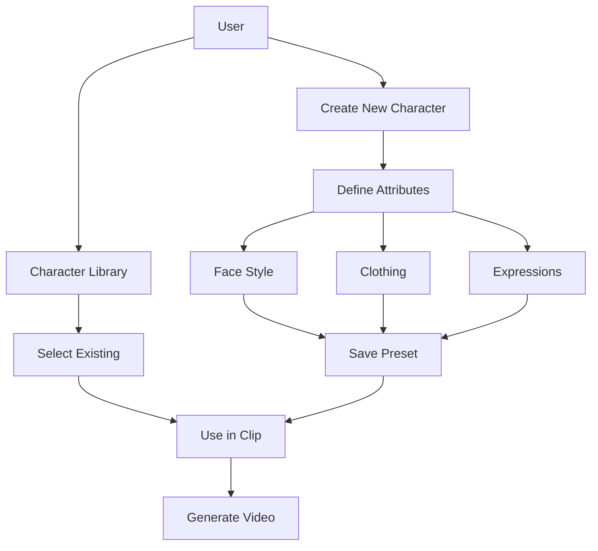
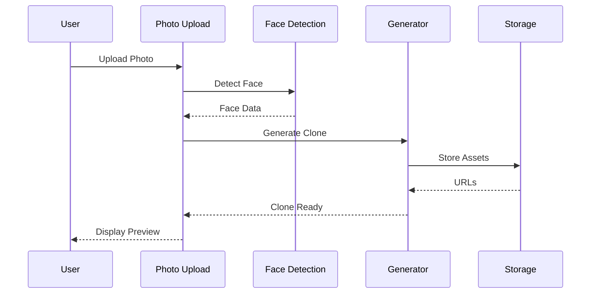
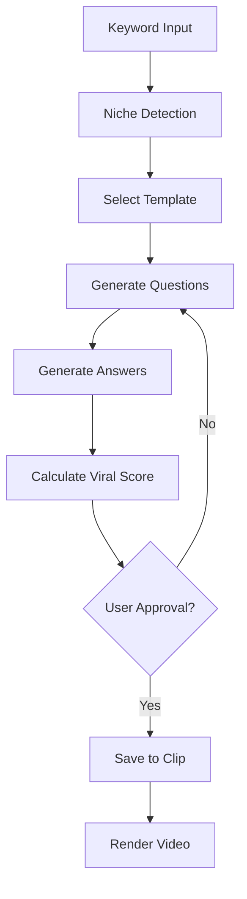

# StreetSpeak AI - Complete Feature Implementation Plan

## Executive Summary

Build a comprehensive street interview video creation platform with AI-powered character consistency, multi-language support, viral content formats, and multi-platform export capabilities.

---

## Core Features Matrix

| Feature | Priority | Complexity | Dependencies |
|---------|----------|------------|--------------|
| Consistent Characters | P0 | High | Avatar System |
| AI Avatar Cloning | P0 | Very High | Face Detection, GANs |
| Keyword-to-Interview | P1 | High | LLM Engine |
| Viral Conversation Styles | P1 | Medium | Prompt Templates |
| Interview Formats | P2 | Medium | Scene Generation |
| Street Scene Generation | P2 | High | Background Rendering |
| Video Length Control | P2 | Low | Duration Logic |
| Product Placement | P3 | Medium | Script Engine |
| Multi-Niche Support | P2 | Low | Content Mapping |
| Multi-Language | P2 | High | Translation API |
| Auto-Captions | P1 | Medium | Caption Engine |
| Clip Library | P1 | Medium | Storage + DB |
| Multi-Platform Export | P2 | Medium | FFmpeg |

---

## 1. Consistent Characters System

### User Stories
- As a creator, I want to create a character with custom looks so viewers recognize them
- As a creator, I want to save character presets so I can reuse them
- As a creator, I want to adjust emotions and expressions per clip

### Components Required

#### CharacterPresetSelector.tsx (New)
```typescript
interface CharacterPreset {
  id: string;
  name: string;
  // Visual attributes
  faceStyle: 'realistic' | 'cartoon' | 'minimal';
  skinTone: string;
  hairStyle: string;
  hairColor: string;
  facialHair?: string;
  eyewear?: string;
  clothing: {
    top: string;
    bottom: string;
    accessories: string[];
  };
  // Emotional range
  defaultExpression: 'neutral' | 'happy' | 'serious' | 'surprised';
  expressions: Record<string, string>; // emotion -> image URL
}

interface CharacterAttributes {
  ageRange: 'young' | 'middle' | 'older';
  gender: 'male' | 'female' | 'non-binary';
  ethnicity: string;
  bodyType: 'slim' | 'average' | 'athletic' | 'plus';
  styleVibe: 'casual' | 'professional' | 'streetwear' | 'formal';
}
```

#### CharacterLibrary.tsx (New)
- Grid view of saved characters
- Create new character modal
- Edit existing character
- Delete character
- Set default character

#### CharacterPreview.tsx (New)
- Real-time preview of character
- Expression toggles
- Outfit selector
- Lighting preview

### Database Schema Extensions
```sql
-- Character presets table
CREATE TABLE character_presets (
  id UUID PRIMARY KEY DEFAULT gen_random_uuid(),
  user_id UUID REFERENCES auth.users(id),
  name TEXT NOT NULL,
  attributes JSONB NOT NULL,
  outfit_config JSONB NOT NULL,
  expression_images TEXT[], -- URLs to expression variants
  is_default BOOLEAN DEFAULT false,
  usage_count INTEGER DEFAULT 0,
  created_at TIMESTAMPTZ DEFAULT NOW(),
  updated_at TIMESTAMPTZ DEFAULT NOW()
);

-- Character usage tracking
CREATE TABLE character_usage (
  id UUID PRIMARY KEY DEFAULT gen_random_uuid(),
  character_id UUID REFERENCES character_presets(id),
  clip_id UUID REFERENCES clips(id),
  expressions_used TEXT[],
  created_at TIMESTAMPTZ DEFAULT NOW()
);
```

### Mermaid Diagram - Character System



---

## 2. AI Avatar Cloning System

### User Stories
- As a creator, I want to upload one photo to create my AI clone
- As a creator, I want my clone to have my style and mannerisms
- As a creator, I want to generate videos without being on camera

### Technical Architecture

#### AvatarCloneService.ts (New)
```typescript
interface AvatarCloneRequest {
  sourceImage: File;
  style: 'realistic' | 'stylized' | 'minimal';
  attributes?: {
    ageAdjustment?: number;
    expressionRange?: string[];
  };
}

interface AvatarCloneResult {
  cloneId: string;
  generatedImages: string[]; // Multiple angles/expressions
  qualityScore: number;
  status: 'processing' | 'ready' | 'failed';
}

class AvatarCloneService {
  async createClone(request: AvatarCloneRequest): Promise<AvatarCloneResult>;
  async getCloneStatus(cloneId: string): Promise<AvatarCloneResult>;
  async generateExpression(cloneId: string, expression: string): Promise<string>;
  async deleteClone(cloneId: string): Promise<void>;
}
```

#### FaceDetection.ts (New)
```typescript
interface FaceData {
  landmarks: {
    eyes: [x: number, y: number][];
    nose: [x: number, y: number][];
    mouth: [x: number, y: number][];
    jawline: [x: number, y: number][];
  };
  attributes: {
    age: number;
    gender: string;
    emotion: string;
    beauty: number;
  };
  quality: {
    sharpness: number;
    brightness: number;
    occlusion: string[];
  };
}
```

#### ClonePreview.tsx (New)
- Upload photo interface
- Progress indicator during generation
- Result gallery
- Quality metrics display
- Regeneration options

### External Services Required
- **Face Detection API**: Face++ or AWS Rekognition
- **Face Generation**: Stable Diffusion + LoRA fine-tuning
- **Video Synthesis**: Wav2Lip or SadTalker

### Mermaid Diagram - Avatar Cloning Flow



---

## 3. Keyword-to-Interview Generation Engine

### User Stories
- As a creator, I want to enter one keyword and get viral street interviews
- As a creator, I want natural questions and answers, not scripted content
- As a creator, I want multiple variations from one keyword

### InterviewGenerationService.ts (New)
```typescript
interface KeywordRequest {
  keyword: string;
  niche: string;
  tone: 'casual' | 'professional' | 'controversial' | 'humorous';
  length: 'short' | 'medium' | 'long';
  language: string;
  style: ConversationStyle;
}

interface GeneratedInterview {
  id: string;
  questions: InterviewQuestion[];
  answers: InterviewAnswer[];
  estimatedDuration: number;
  viralScore: number;
  trendingElements: string[];
}

interface InterviewQuestion {
  id: string;
  text: string;
  type: 'hook' | 'main' | 'follow-up' | 'pivot';
  emotionalTriggers: string[];
  expectedAnswerLength: number;
}

interface InterviewAnswer {
  speaker: 'host' | 'guest';
  content: string;
  suggestedExpression: string;
  captionEmphasis: string[];
}
```

### NicheTemplates.ts (New)
```typescript
const NICHE_TEMPLATES: Record<string, {
  keywords: string[];
  hotTopics: string[];
  commonPhrases: string[];
  emotionalTriggers: string[];
}> = {
  money: {
    keywords: ['investment', 'side hustle', 'debt', 'salary', 'crypto'],
    hotTopics: ['passive income', 'financial freedom', 'money mistakes'],
    emotionalTriggers: ['fear', 'greed', 'envy', 'hope'],
  },
  fitness: {
    keywords: ['workout', 'diet', 'weight loss', 'muscle', 'health'],
    hotTopics: ['quick results', 'superfoods', ' gym tips'],
    emotionalTriggers: ['vanity', 'health anxiety', 'motivation'],
  },
  relationships: {
    keywords: ['dating', 'marriage', 'breakup', 'love', 'friendship'],
    hotTopics: ['red flags', 'dating advice', 'relationship goals'],
    emotionalTriggers: ['loneliness', 'heartbreak', 'hope'],
  },
  // ... more niches
};
```

### StylePromptEngine.ts (New)
```typescript
const CONVERSATION_STYLES = {
  hot_takes: {
    systemPrompt: "Generate provocative, opinionated questions that challenge conventional wisdom...",
    questionPattern: ["What's your take on...", "Unpopular opinion...", "Everyone thinks..."],
    answerLength: "30-60 seconds",
  },
  callouts: {
    systemPrompt: "Generate direct questions calling out common behaviors or misconceptions...",
    questionPattern: ["Why do people...", "Can we talk about...", "Stop doing..."],
    answerLength: "45-90 seconds",
  },
  confessions: {
    systemPrompt: "Generate questions that invite personal, vulnerable admissions...",
    questionPattern: ["What's a secret...", "Have you ever...", "I gotta confess..."],
    answerLength: "60-120 seconds",
  },
  red_flags: {
    systemPrompt: "Generate questions identifying warning signs and dealbreakers...",
    questionPattern: ["What's a red flag...", "When do you walk away...", "Dealbreaker?"],
    answerLength: "30-60 seconds",
  },
  street_quiz: {
    systemPrompt: "Generate random, fun questions people can quickly answer...",
    questionPattern: ["Quick question...", "On a scale of 1-10...", "Hot take?"],
    answerLength: "15-30 seconds",
  },
  // ... 5 more styles
};
```

### Mermaid Diagram - Keyword-to-Interview Flow



---

## 4. Viral Conversation Styles System

### 10 Conversation Styles

| Style | Description | Best For | Avg Duration |
|-------|-------------|----------|--------------|
| **Hot Takes** | Provocative opinions on trending topics | Engagement, debate | 45-90s |
| **Callouts** | Direct questions calling out behaviors | Virality, shares | 30-60s |
| **Confessions** | Personal admissions, vulnerable moments | Trust, connection | 60-120s |
| **Red Flags** | Warning signs, dealbreakers | Education, awareness | 30-60s |
| **Street Quizzes** | Quick-fire random questions | Entertainment | 15-30s |
| **Would You Rather** | Binary choice scenarios | Debate, comments | 20-45s |
| **Truth or Dare** | Challenging personal questions | Drama, engagement | 45-90s |
| **Expert Takes** | Authority-building Q&A | Thought leadership | 60-120s |
| **Story Time** | Narrative experiences | Entertainment | 90-150s |
| **Myth Busters** | Debunking common misconceptions | Education | 45-90s |

### StyleSelector.tsx (New)
```typescript
interface ConversationStyle {
  id: string;
  name: string;
  icon: string;
  description: string;
  examplePrompt: string;
  viralElements: string[];
  typicalDuration: [number, number]; // min, max seconds
  emotionalTone: string[];
  bestNiches: string[];
}

const CONVERSATION_STYLES: ConversationStyle[] = [
  {
    id: 'hot_takes',
    name: 'Hot Takes',
    icon: '🔥',
    description: 'Provocative opinions that spark debate',
    examplePrompt: "What's your take on people who don't tip?",
    viralElements: ['controversy', 'polarization', 'comment bait'],
    typicalDuration: [45, 90],
    emotionalTone: ['defensive', 'passionate', 'agree/disagree'],
    bestNiches: ['money', 'dating', 'lifestyle'],
  },
  // ... 9 more styles
];
```

### StyleConfigurator.tsx (New)
- Style selection grid
- Custom prompt input
- Intensity slider (mild → spicy → nuclear)
- Target audience selector
- Expected reaction preview

---

## 5. Interview Format Options

### Format Types

| Format | Description | Use Case |
|--------|-------------|----------|
| **Solo** | Single speaker addressing camera | Thought leadership |
| **Face-to-Face** | Two people talking | Debate, discussion |
| **Reporter Style** | Interviewer asking questions | Traditional interview |
| **Full-Body Street** | Subject shown fully, street background | Authenticity, street credibility |
| **Reaction** | Split screen or picture-in-picture | Reacting to content |
| **Narrative** | Subject telling story to camera | Personal brand |

### FormatConfig.ts (New)
```typescript
interface InterviewFormat {
  id: string;
  name: string;
  visualLayout: 'single' | 'split' | 'pip' | 'full-body';
  cameraAngle: 'close-up' | 'medium' | 'wide' | 'over-shoulder';
  background: 'solid' | 'blur' | 'street' | 'studio';
  speakerVisibility: {
    host: boolean;
    guest: boolean;
  };
  transitionStyle: string;
}

const INTERVIEW_FORMATS: InterviewFormat[] = [
  {
    id: 'solo',
    name: 'Solo',
    visualLayout: 'single',
    cameraAngle: 'close-up',
    background: 'blur',
    speakerVisibility: { host: true, guest: false },
    transitionStyle: 'cut',
  },
  {
    id: 'face-to-face',
    name: 'Face-to-Face',
    visualLayout: 'split',
    cameraAngle: 'over-shoulder',
    background: 'street',
    speakerVisibility: { host: true, guest: true },
    transitionStyle: 'crossfade',
  },
  {
